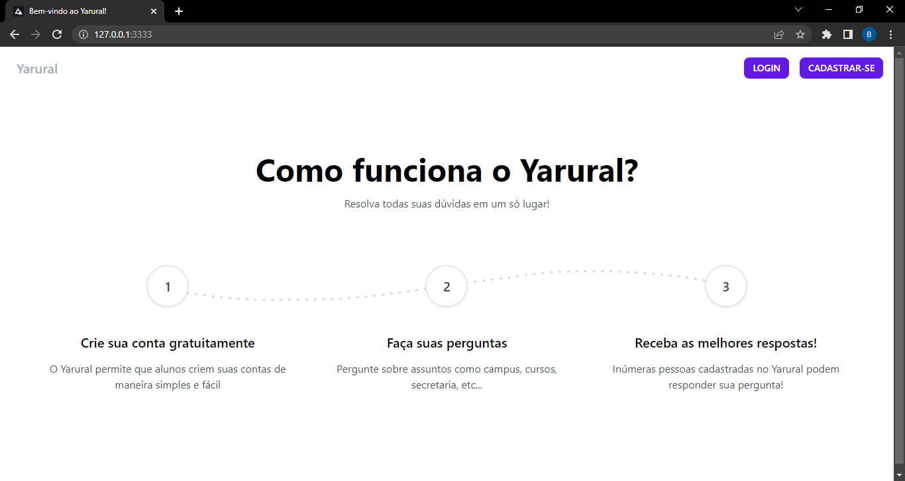
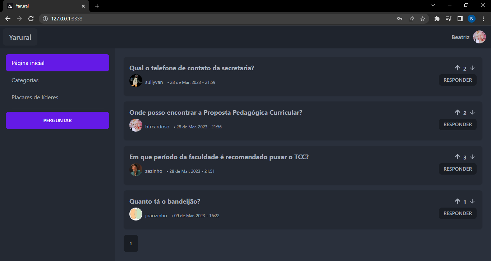
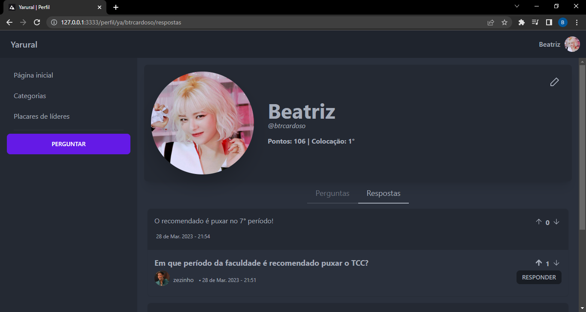
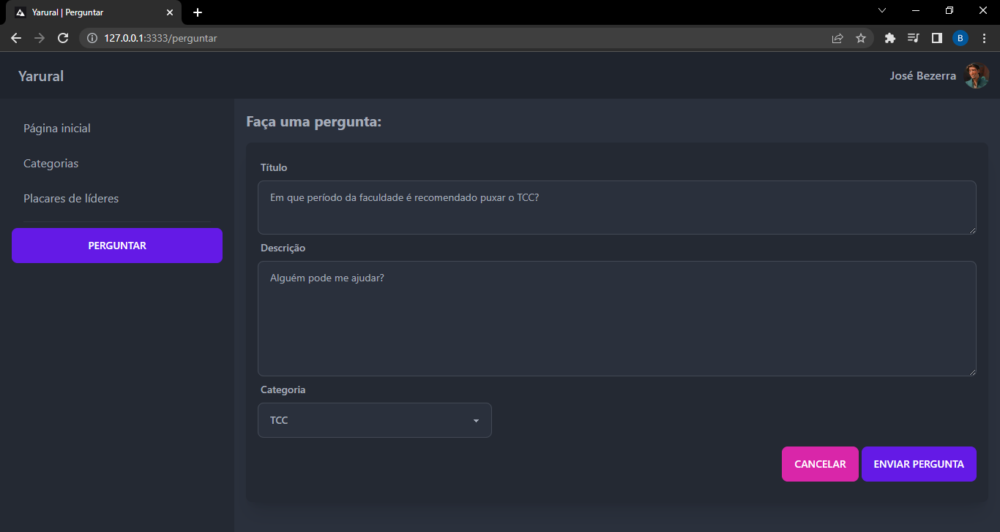
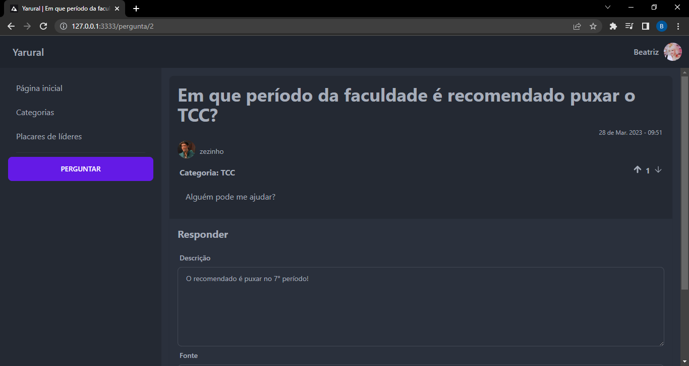
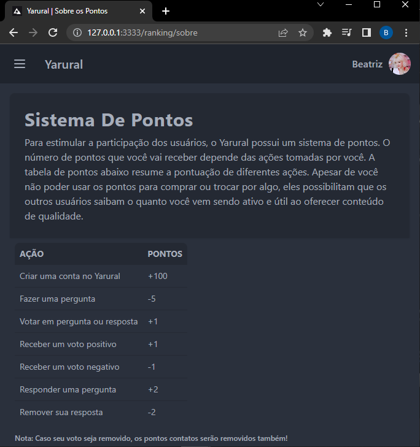
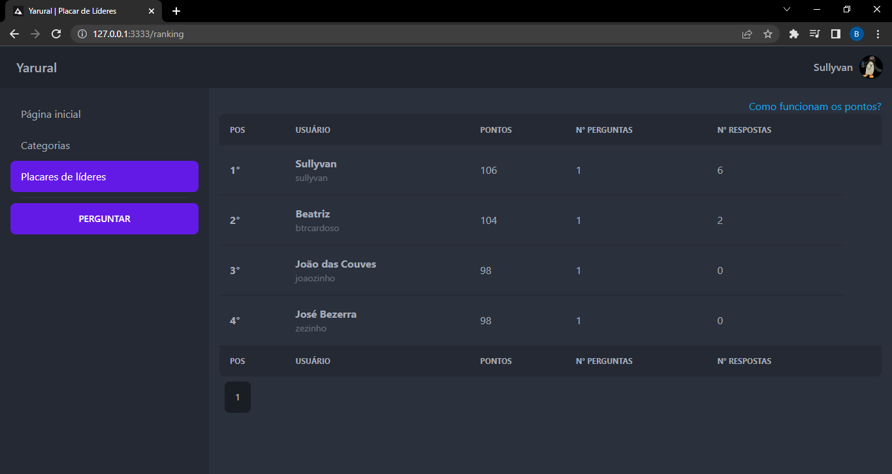

# Yarural

Site de perguntas e respostas feito para a disciplina de Programação para WEB da UFRRJ.



## Funcionamento

- Veja as perguntas e respostas já feitas!



- Crie seu perfil!



- Faça perguntas!



- Responda e seja respondido!



- Você começa com 100 pontos e pode utilizá-los para perguntar, além de ganhar mais pontos ao responder perguntas!



- Os usuários com mais pontos ficam no topo dos rankigs!



## Tecnologias utilizadas

Para a criação deste projeto, as seguintes tecnologias foram utilizadas:

- [Node.js](https://nodejs.org/en): Como um tempo de execução JavaScript assíncrono orientado a eventos, o Node.js foi projetado para criar aplicativos de rede escaláveis.
- [AdonisJS](https://adonisjs.com/adonisjs-at-a-glance): AdonisJS é uma estrutura de back-end para criar aplicativos da Web dinâmicos orientados a dados. Usando o AdonisJS, é possível lidar com as solicitações HTTP, consultar o banco de dados, autenticar usuários, fazer upload de arquivos, enviar e-mails e muito mais.
- [DaisyUI](https://daisyui.com/): Um plug-in gratuito para Tailwind CSS. 

## Para executar a aplicação em sua máquina local

- Configure um ambiente [Node](https://nodejs.org/en);

- Faça o download dos arquivos deste repositório;

- Na pasta onde estão os arquivos deste repositório, cole no terminal:
```bash
npm install
```

- Copie o conteúdo do arquivo ```.env.example``` em um arquivo ```.env```.

- Crie uma pasta chamada ```tmp```.

- Popule o banco de dados com os Seeders.
```bash
node ace db:seed
```

- Atualize a migration:
```bash
node ace `migration:fresh
```

- Inicie o servidor
```bash
node ace serve --watch
```

- Siga o link para ver o site: http://127.0.0.1:3333.